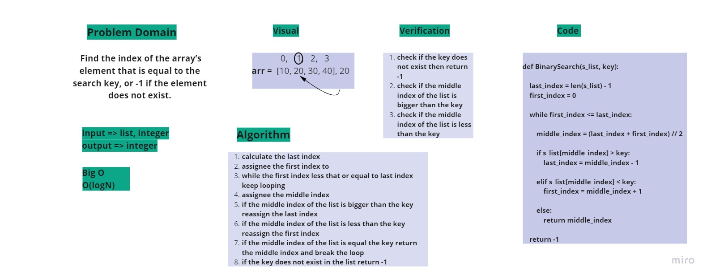

## BinarySearch
Title: array-binary-search

Challenge details:  
BinarySearch function takes in 2 parameters: a sorted array and the search key. (Without any methods) return the index of the array’s element that is equal to the search key, or -1 if the element does not exist.

whiteboard:
