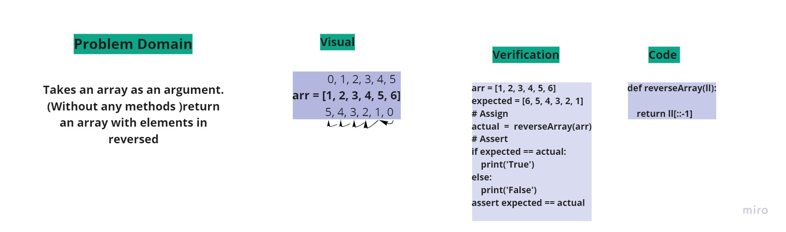

## Reverse an Array
Title: array-reverse
Challenge details:  
reverseArray function takes an array as an argument. (Without any methods )return an array with elements in reversed order.
whiteboard:
