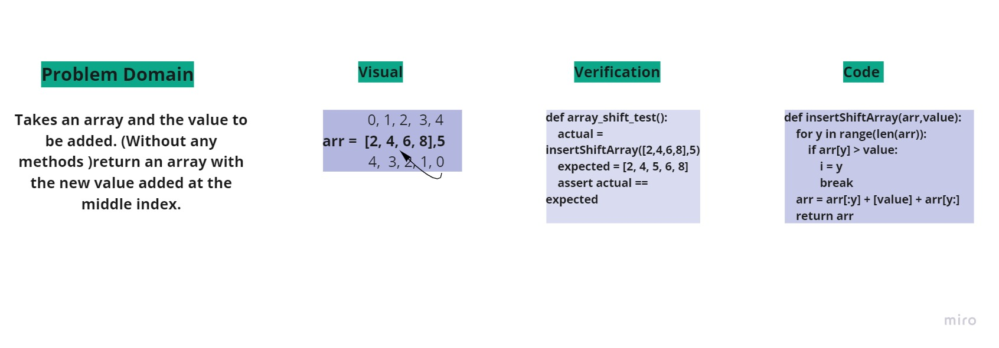

# Challenge Summary
Shift a list
## Challenge Description

insertShiftArray function takes an array and the value to be added. (Without any methods )return an array with the new value added at the middle index.

## Approach & Efficiency
I tried to take the half of the array lenght and the add the new number but it didn't work.

## Solution
